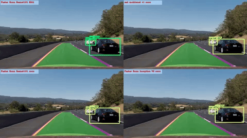

# Automatic_Drive_Detection_Tensorflow_Convnet

This is an implemention of [Tensorflow detection model zoo](https://github.com/tensorflow/models/blob/master/research/object_detection/g3doc/detection_model_zoo.md) on Python 3 and TensorFlow. The project adopts four different models in Model Zoo to detect cars on road in demo video. 

The detection result based on differen models are shown in flowing link videos.
* [Final result video](https://www.youtube.com/watch?v=Pv2qcNR-PMs)
    
